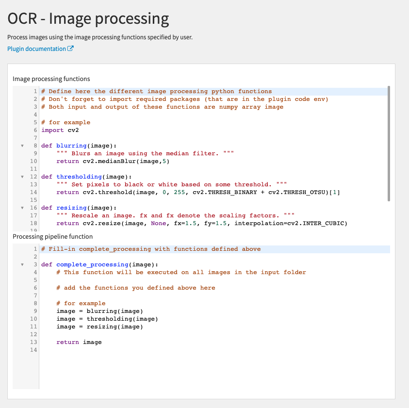

# dss-plugin-tesseract-ocr
Plugin for optical character recognition (OCR) in python using the tesseract engine

The plugin has four components (three recipes and a notebook template):
- Image Conversion recipe: convert all types of images into jpg images and split multi-page PDF documents into multiple jpg images. It also convert images to grayscale.
- Text Extraction recipe:: extract text from images using tesseract and output a dataset with a filename column and a text column. This recipe has parameters to recombine multi-page PDF (that were split into multiple images in the Image Conversion recipe) into a single text, to specify the language used in tesseract, and to remove special charaters from the extracted text. It takes as input a folder of JPG images (ideally the output of the Image Conversion recipe or of the Image Processing recipe).
- Image Processing notebook: notebook to explore different types of image processing to improve (or not) text extraction from tesseract. Then, the functions that were tested in the notebook can be used in the Image Processing recipe.
- Image Processing recipe: recipe to process images using functions defined by the user in the python editor area of the recipe form.

## Instructions to use the notebook template
 
Go to notebook (G+N) and create a new python notebook. Select the template `Image processing for text extraction` and then check that the plugin code env is selected (you can set it in the tab Kernel > Change kernel).

Then, you can use the notebook to explore different type of image processing (use the pre-defined functions or write your owns). You need to enter the input folder id manually in the notebook.

In the notebook, you can visualize the effect of image processing functions using the function `display_images_before_after` defined in the notebook (display image before and after processing):

You can also look at the extracted text before and after image processing using the function `display_images_before_after` defined in the notebook:

When you are done exploring different type of image processing functions, you can copy the functions you want and paste them in the Image Processing recipe form.

## Requirements

### tesseract

Tesseract must be installed on DSS instance server:

#### Mac
Using homebrew: `brew install tesseract`
Using macports: `sudo port install tesseract`

#### Linux
Tesseract is available directly from many Linux distributions. 
`sudo apt install tesseract-ocr`

For more informations, go to: <https://github.com/tesseract-ocr/tessdoc/blob/master/Home.md>.

### pdf2image

To be able to use the python package pdf2image:

#### Mac
For macOS using brew: `brew install poppler`.
Mac users will have to install poppler for Mac (<http://macappstore.org/poppler/>).

#### Linux
Most distros ship with pdftoppm and pdftocairo. If they are not installed, refer to your package manager to install poppler-utils

For more informations, go to: <https://github.com/Belval/pdf2image>.

### Specific languages

If you want to specify languages in tesseract, you must install them on your DSS instance, you can find instructions on how to install them and the code for each language here <https://tesseract-ocr.github.io/tessdoc/Data-Files>.

Example for the english language (code `eng`):

#### Mac
Using homebrew: `brew install tesseract-eng`

#### Linux
`sudo apt install tesseract-ocr-eng`

