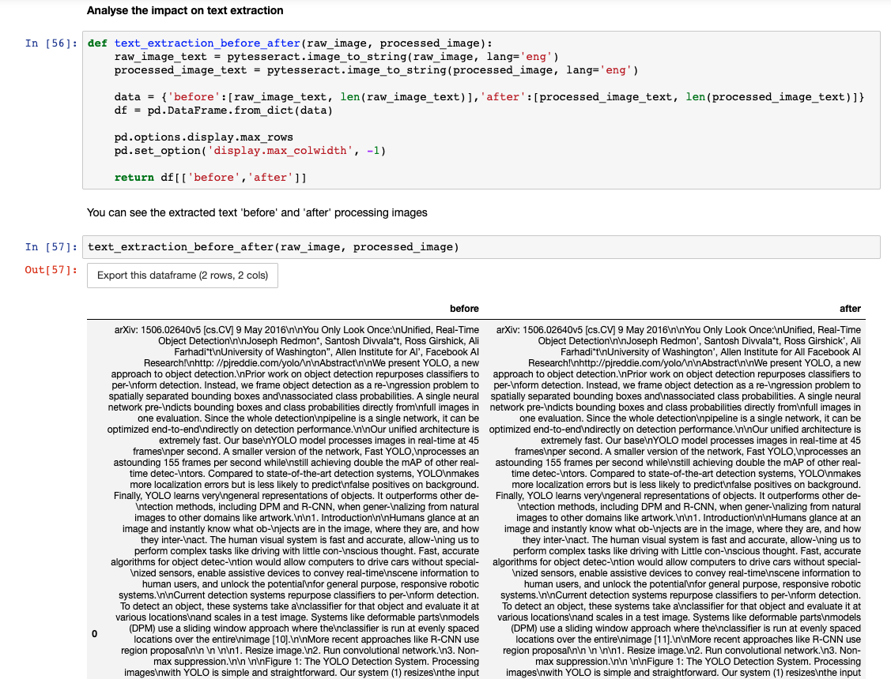

# dss-plugin-tesseract-ocr
Plugin for optical character recognition (OCR) in python using the tesseract engine

The plugin has three components (two recipes and a notebook template):
- image-conversion recipe: convert all types of images into jpg images and split multi-page PDF documents into multiple jpg images. It also convert images to grayscale.
- ocr-text-extraction-dataset recipe:: extract text from images using tesseract and output a dataset with a filename column and a text column. This recipe has parameters to recombine formely split multi-page PDF into a single text, to specify the language used in tesseract, and to remove special charaters from the extracted text. It takes as input a folder of JPG images (the output of the image-conversion recipe or of the notebook).
- image processing notebook: notebook to explore different types of image processing to improve (or not) text extraction from tesseract. Then, the notebook acts as a recipe to process images and output a folder of processed images that can be used by the ocr-text-extraction-dataset recipe.

## Instructions to use the notebook template
 
In order to use notebook template as code recipe after exploring different image processing, you (or the admin) need to create a code env with the same requirements as the plugin code env (because notebooks converted into recipe can't use plugin code envs). These requirements can be found in the `requirements.txt` file of the plugin:
```
pdf2image==1.6.0
pytesseract==0.2.7
Pillow==7.0.0
matplotlib==3.2.0
opencv-python>=3.1.0
deskew>=0.10.0
```

Go to notebook (G+N) and create a new python notebook. Select the template `Image processing for text extraction` and select as code env the one you created manually.


Then, you can use the notebook to explore different type of image processing (use the pre-defined functions or write your owns). You need to enter the input folder id manually in the notebook.

In the notebook, you can visualize the effect of image processing functions using the function `display_images_before_after` defined in the notebook (display image before and after processing):


You can also look at the extracted text before and after image processing using the function `display_images_before_after` defined in the notebook:



When you are done exploring different type of image processing, you can convert this notebook into a code recipe (+ CREATE RECIPE button) and choose the input folder and the output folder (not datasets).

Once in the code recipe, you need to copy the output folder id into the `output_folder_id` variable above and delete the last two lines that were automatically added to the code. More detailed instructions are written in the notebook.

You also have to change the code env of the code recipe (in the advanced tab) for the newly created code env that has the same packages as the plugin code env.


## Requirements

### tesseract

Tesseract must be installed on DSS instance server:

#### Mac
Using homebrew: `brew install tesseract`
Using macports: `sudo port install tesseract`

#### Linux
Tesseract is available directly from many Linux distributions. 
`sudo apt install tesseract-ocr`

For more informations, go to: <https://github.com/tesseract-ocr/tessdoc/blob/master/Home.md>.

### pdf2image

To be able to use the python package pdf2image:

#### Mac
For macOS using brew: `brew install poppler`.
Mac users will have to install poppler for Mac (<http://macappstore.org/poppler/>).

#### Linux
Most distros ship with pdftoppm and pdftocairo. If they are not installed, refer to your package manager to install poppler-utils

For more informations, go to: <https://github.com/Belval/pdf2image>.

### Specific languages

If you want to specify languages in tesseract, you must install them on your DSS instance, you can find instructions on how to install them and the code for each language here <https://tesseract-ocr.github.io/tessdoc/Data-Files>.

Example for the english language (code `eng`):

#### Mac
Using homebrew: `brew install tesseract-eng`

#### Linux
`sudo apt install tesseract-ocr-eng`


